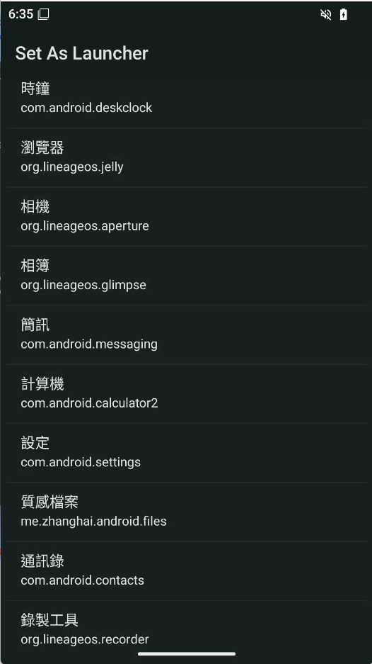

# 🚀 Set As Launcher (SAL)

**Set As Launcher (SAL)** is an ultra-minimalist, high-performance utility designed to transform ANY Android application into your system launcher. It is built for developers, minimalist enthusiasts, and legacy hardware recovery.



The philosophy is simple: **Zero bloat. Absolute control.**

---

## 🌟 Why SAL?

In an era of multi-hundred-megabyte apps, SAL stands as a testament to surgical engineering. 

### 📊 Performance Comparison

| Metric | Normal Launcher | **Set As Launcher (SAL)** | Difference |
| :--- | :--- | :--- | :--- |
| **APK Size** | 10 MB ~ 50 MB | **< 30 KB** | **⬇️ 99.9%** |
| **RAM Usage (PSS)** | 150 MB ~ 300 MB | **30 MB ~ 50 MB** | **⬇️ 80%** |
| **Java Heap** | 50 MB ~ 120 MB | **< 10 MB** | **⬇️ 90%** |
| **Dependencies** | 30+ (Material, etc.) | **0 (None)** | **Pure Java** |
| **Background Service** | Multiple / Persistent | **0 (None)** | **Silent** |
| **Min Compatibility** | Android 8.0+ | **Android 2.3+** | **Universal** |
| **Target SDK** | Latest Only | **Latest (API 37+)** | **Up-to-date** |

- **🪶 Ultra-Lightweight**: The final APK is a "dehydrated" masterpiece, often under 30KB.
- **⚡ Zero Dependencies**: 100% Pure Java. No `AppCompat`, no `Material Components`, no `Jetpack`. We avoided Kotlin to eliminate the `kotlin-stdlib` overhead (saving ~1MB+ of metadata and method count), keeping the binary at its absolute minimum.
- **📟 Extreme Compatibility**: Runs on everything from **Android 2.3 (Gingerbread, API 9)** to the latest **Android 17 (API 37+)**.
- **🚀 Lightning Fast**: Instantaneous cold-start performance with zero background memory footprint.
- **🛡️ Privacy First**: No internet permission. No tracking. No analytics. Just code.

### 🤖 SAL vs. Automation Engines (Tasker/Macrodroid)

Why use a dedicated tool instead of an automation script?

| Metric | Automation Engines | **Set As Launcher (SAL)** |
| :--- | :--- | :--- |
| **Background Service** | **Persistent** (Always running) | **None** (Triggered by OS) |
| **Memory (Background)** | 30 MB ~ 100 MB+ | **0 MB** (Thoroughly released) |
| **Launch Latency** | High (Engine logic processing) | **Zero** (Direct OS Intent) |
| **Power Consumption** | Medium (Continuous monitoring) | **None** (Zero drain when idle) |
| **Complexity** | High (Complex rules/profiles) | **Surgical** (One-click setup) |

---

## 🛠 Features

- **Any-App-as-Launcher**: Select any installed application to act as your primary Home interface.
- **Intelligent Redirect**: Automatically detects when it is invoked as the Home screen and launches your target app.
- **Legacy Support**: Specialized "Helper Class" logic to prevent crashes on pre-Honeycomb (API < 11) devices while using modern APIs where available.
- **Surgical UI**: Programmatic layouts for maximum speed and minimum resource consumption.
- **R8/ProGuard Optimized**: Fully optimized build pipeline to strip away every unnecessary byte.

---

## 📖 How to Use

1. **Install** the SAL APK.
2. **Open** the app from your drawer.
3. **Select** the application you want to use as your "Real Launcher" from the list.
4. **Press Home** and select "Set As Launcher" as your **Always** default.
5. **Boom.** Your target app is now your launcher.

*Need to change it? Simply open "Set As Launcher" again or use the built-in "Home Settings" shortcut.*

---

## 🏗 Technical Specifications

- **Language**: Pure Java
- **Min SDK**: API 9 (Android 2.3)
- **Target SDK**: API 37+
- **Size**: ~ 26 KB (Release Build)
- **Architecture**: Single-Activity, Zero-Dependency Architecture.

---

## 🛠 Hardcore Build Guide (No Gradle)

For those who distrust modern build systems, SAL can be compiled using the raw Android SDK tools:

1. **Compile Java**:
   ```bash
   javac -target 1.8 -source 1.8 -bootclasspath path/to/android.jar MainActivity.java
   ```
2. **Dex it**:
   ```bash
   d8 --release --lib path/to/android.jar MainActivity.class
   ```
3. **Package it**:
   ```bash
   aapt package -f -M AndroidManifest.xml -I path/to/android.jar -F SAL.apk.unaligned
   ```

---

## 📜 License
**MIT License**. Keep it light, keep it fast. Stay in control.

---

**Developed with ❤️ by LiferLighdow**
